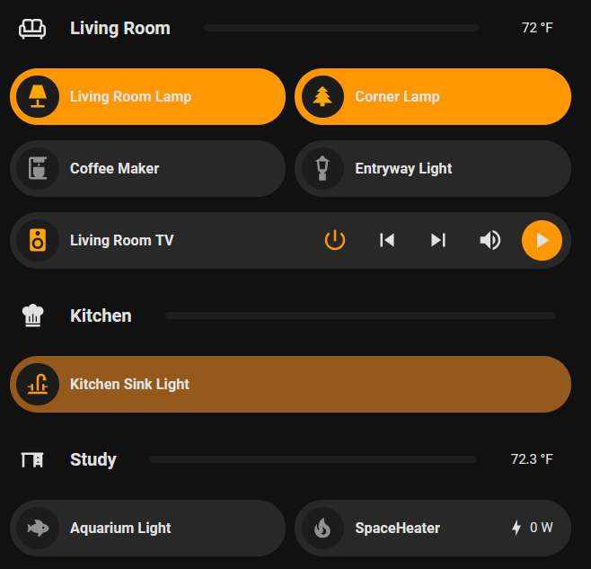
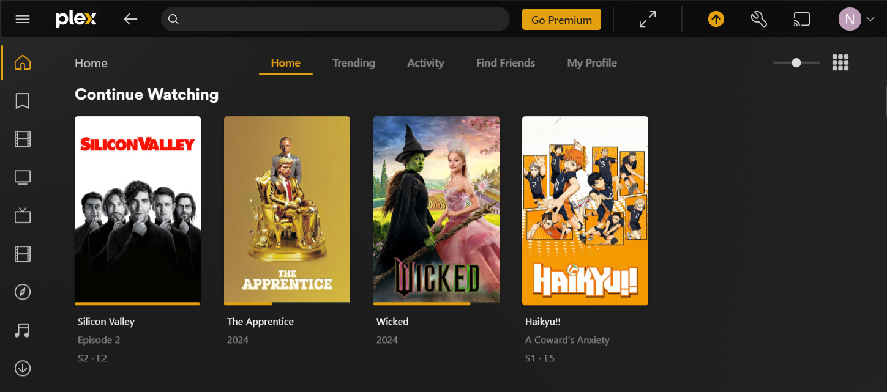
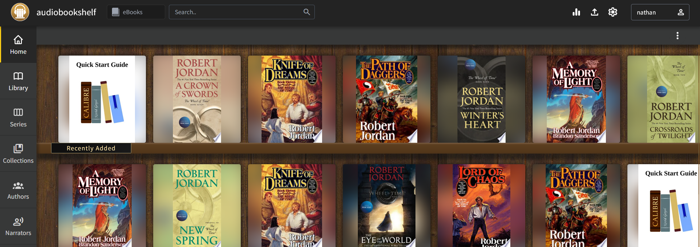
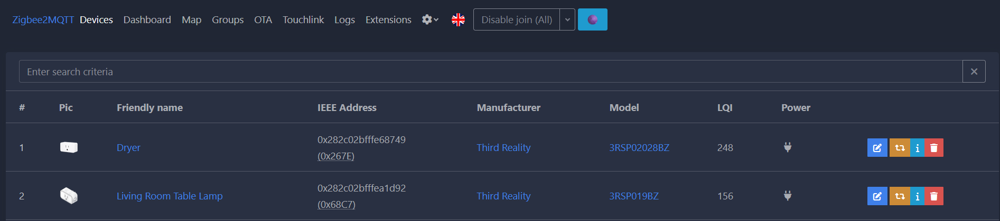
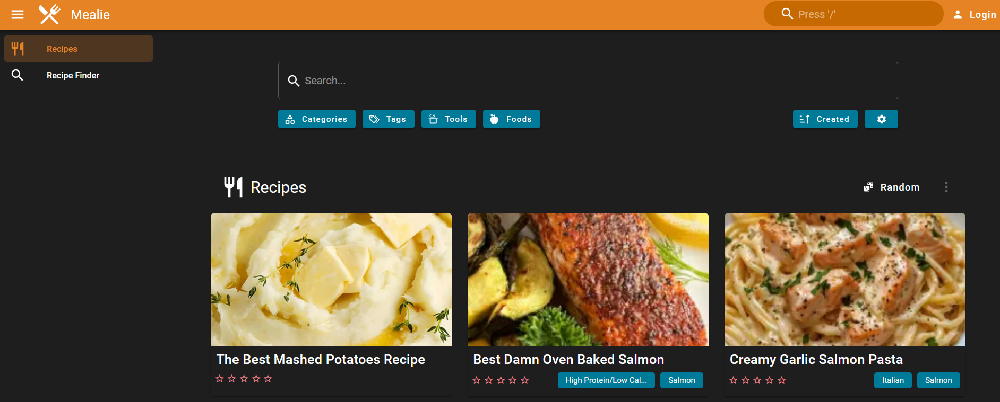
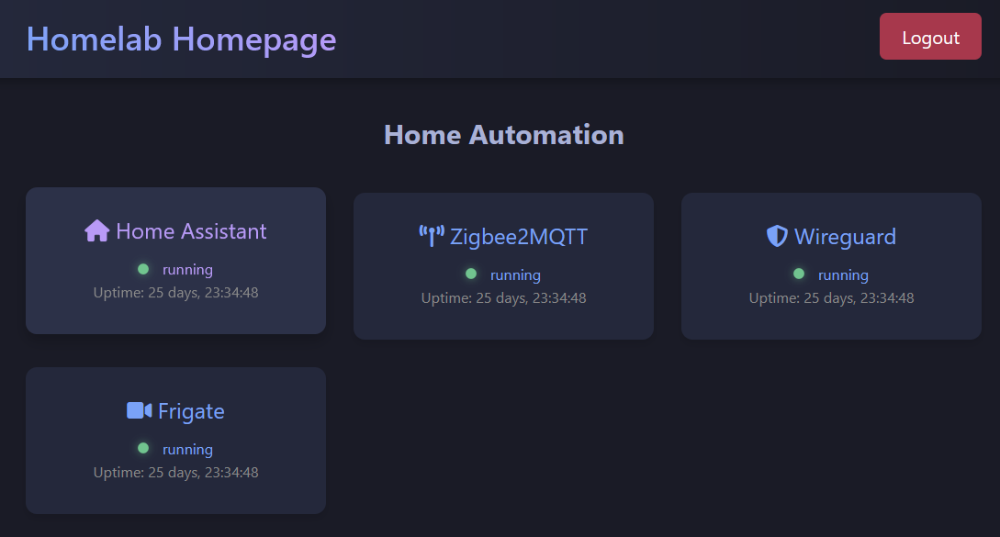

This is my first post on this topic. I hope to use this site primarily as a notebook for myself on what I've tried, and any useful notes or thoughts that come out of it. If this is ever useful for others, well that's a cherry on top.

## My Home Lab
A home lab is a lot of things for a lot of people. For me it's a way to host higher quality media than Netflix can stream, host home automation, and host some home security. It also serves as a pretty fun development playground where I can work with all sorts of interesting open source projects and fiddle to my hearts content. 

I've done things like make my own websites and hosted them off of it for trial runs, hosting open source projects and using them to see if I like them, and just general satisfactions of curiousities that I have. 

My favorite was a homelab dashboard idea that I had and implemented in a couple days. I wrote about it [more below](#homelab-homepage) if you're curious. 

Anyways...on to what I was originally going to write about.

# My Homelab setup

Here is the current list of things that makeup my homelab. It's not much, but it's more than enough to satisfy my current usecase.

## Compute
HP Prodesk 600 G3 (Bought used for $50 USD)
- Intel Core i5-7500T 2.7  GHz
- 8 GB RAM
- 500 GB HDD
- Ubuntu 24.04 LTS

## Upgrades
- 1 TB OS SSD
- 2 TB External Media Drive

## Services
__All__ of my services, are run via Docker, using `compose.yaml`s. There is an incredible ecosystem out there of people who have created cool FOSS projects, and then created a `Dockerfile` and associated `compose.yaml` that makes spinning up a new service as simple as copy-pasting a compose into a new directory, mapping a couple volumes, and a final `docker compose up`. 

This isn't the only way to run many of these services, lots of people like to use things like [proxmox](https://www.proxmox.com/en/), some people are just installing these services on baremetal all on the same machine. The world is really your

- [Home Assistant](https://www.home-assistant.io/) - Home Automation
- [Frigate](https://frigate.video/) - Home Surveillance
- [Plex](https://www.plex.tv/) - Home Media Server
- [audiobookshelf](https://www.audiobookshelf.org/) - Hosted Ebooks and Audiobooks
- [Mosquitto](https://mosquitto.org/) - MQTT Server
- [Zigbee2mqtt](https://www.zigbee2mqtt.io/) - Zigbee 2 MQTT service
- [WG-Easy](https://github.com/wg-easy/wg-easy) - Wireguard Tunnel 
- [Mealie](https://mealie.io/) - Meal Planning and Recipe Book

### Home Assistant

This was my very first hosted service and it actually started on an old Raspberry Pi4 1Gb as most people's homelabs do. I still have that Pi sitting around, I need to figure out what to do with it. Maybe a custom NAS.

Anyways, Home Assistant is a home automation software that integrates with seemingly everything. It takes things that Apple Homekit, Google Home, and all the other home automation cloud apps do, and gives you the ability to do it locally, with fully local hardware.

Home assistant has a few benefits:
1. You don't rely on a company not shutting down their cloud server
2. Privacy is by default higher, as it is not a requirement that devices are able to "phone-home"
3. You get a lot more customization, like, it's not even close

I love it. I have lights that turn on when I open my front door, automations that change the hue of my lights depending on what the sun would look like outside, power monitoring, laundry finished notifications using power monitoring....the list could go on. 

<figure style="text-align: center;">
  
  <figcaption>My Home Assistant dashboard</figcaption>
</figure>

This is an excellent entry to self-hosted/homelab things if you're thinking about fiddling.

### Frigate
This was second. An NVR system with built-in object detection, for free! This is one of my favorite projects to watch, and I hope to contribute some day. It works very well, and integrates directly with Home Assistant as well.

For obvious reasons I won't get into specifics, but this is a really fun solution if to host if you'd like to setup some cameras around your house for your own surveillance purposes. Again, you get to sidestep these cloud hosts having your video, seeing your data, and doing who knows what with it by self-hosting this.

### Plex
A pretty good media server. Honestly the best thing about it is that there are many pretty good clients on TVs, phones, computers, etc. This makes watching from anywhere easy and the defacto home media server for many years, but has up and coming competitors like [Jellyfin](https://jellyfin.org/) that may take it over. Plex is not FOSS, and not totally free, but they provide a pretty decent subset of features for free and it has been enough for me.

<figure style="text-align: center;">
  
  <figcaption>Plex Media Server UI</figcaption>
</figure>

They're currently reducing those free features though, so I might start thinking about other apps.

### audiobookshelf
I love ebooks, and my wife loves audiobooks so when we purchase and download them we put them here. It's a bit new to us, but it integrates with Kindle, and has some pretty decent client apps.

<figure style="text-align: center;">
  
  <figcaption>Audiobookshelf - ebooks and audiobooks management</figcaption>
</figure>

### Mosquitto
This thing is a bit obscure. It's a MQTT server which is a common iot communication framework. I got it because Frigate <> Home Assistant integration requires it, but then have increased it's usage by getting things like Zigbee2mqtt, making zigbee protocol devices available on the mqtt server. Then I connect Home Assistant to Mosquitto and all of a sudden I can use so many devices.

### Zigbee2mqtt
Zigbee2mqtt creates an interface where you can pair zigbee devices, and expose their parameters to an mqtt server. This makes things like Home Assistant and Frigate and anything else running on my home network be able to communicate with all of these zigbee devices. This is an amazing project with thousands of devices supported, I highly recommend it.

<figure style="text-align: center;">
  
  <figcaption>Zigbee2MQTT dashboard for managing IoT devices</figcaption>
</figure>

### WG-Easy
My Wireguard VPN server! If you don't know why having a VPN into your home is useful, boy you're missing out..[read here for why](#sidenote-home-network-access-abroad)

WG-Easy does what it says, it makes wireguard easy. I originally set up my wireguard server like a caveman using this [blog post](https://markliversedge.blogspot.com/2023/09/wireguard-setup-for-dummies.html). I learned a lot, and then my server crashed and I didn't want to do this all again.

Enter WG-Easy. It's a docker image that you can spin up a wireguard server with, and provides a really nice web UI for adding clients and monitoring their usage. 

### Mealie

Mealie is a wonderful new-to-me application which takes cooking blog URLS, de-shittifies them, and gives you the ingredients and directions in a no-nonsense way. It's so helpful for finding recipes you like, dumping the ones you don't and even has built in shopping lists that you can just click on a recipe and it automatically populates everything you need.

<figure style="text-align: center;">
  
  <figcaption>Mealie Recipe Manager interface</figcaption>
</figure>

It's very convenient and it's pretty!

## Services I'm thinking about
The journey never ends with self-hosting and homelabs. Here is a couple things I'm thinking about doing next

- Reverse proxy like [traefik](https://traefik.io/traefik/), so I don't need to remember ports
- [Pihole](https://pi-hole.net/), for whole home ad blocking
- A [NAS](https://www.techtarget.com/searchstorage/definition/network-attached-storage), for a larger more available media center
- A [3-2-1 data backup](https://www.backblaze.com/blog/the-3-2-1-backup-strategy/) solution
- A [homepage](https://gethomepage.dev/)

I'm sure there are others I'm forgetting but I'll keep browsing https://reddit.com/r/homelab and https://redditcom/r/selfhosted so I'm sure it won't be long till another idea hits me.

## Sidenotes
When I start rambling I break them out into these sidenotes...maybe they'll become their own post at some point, probably not.

### Homelab-homepage
I vibe-coded (before they called it vibe coding) a "homelab-homepage" that I thought was neat. If you don't know me, I'm a python developer, with zero JS and zero frontend experience, so I got deep into the weeds with CSS + HTML + Jinja2 + Copilot to create a semi-functional dashboard page. The goal was it would would be a landing page I could access all my services from without having to create a million bookmarks or remember what port my Wireguard server was running on when I need to access it 5 months after I set it up.

"homelab-homepage" has:
- Simple Auth (Simple login that's setup on first startup)
- Docker Health Monitoring (periodically check status of docker containers)
- Fully Responsive (Thanks chatgpt and an absurd amount of css)
- Hot links to all my home server landing pages (ports be gone)
- A `Dockerfile` and accompanying `compose.yaml` that I thought maybe one day people would use
Here's a short screenshot:
<figure style="text-align: center;">
  
  <figcaption>My custom homelab homepage dashboard</figcaption>
</figure>

I then of course found a much better already completed product at [homepage](https://gethomepage.dev/) and promptly abandoned that project, but I learned a lot so I still see it as a win.

###  Home Network access Abroad
When I have all these services running on my home network, it's great when I'm home, but the second I leave the house, I can't connect! There are a couple ways to solve this...

#### Expose service port directly
Some people expose their services to the internet directly! This is a terrible idea, if there are any vulnerabilities in the service, you are potentially compromising your network, I don't recommend.

#### Reverse Proxy
Some people setup a reverse proxy like nginx or traefik, this is better, assuming you use security measures in addition to the reverse proxy, and implement auth. It comes with the advantage of instead of navigating to services by ports, you can specify plex.mydomain.com or frigate.mydomain.com and you'll magically end up at your service. 

You also get HTTPS certs, ssl, etc....it's very nice. I have thought about doing this a lot but haven't gotten around to it.

#### Tailscale
A lot of people use something called Tailscale, which is essentially cloud hosted wireguard, but you don't have to make it yourself (I think). I don't use this, mostly because I didn't realize it existed, but also I like things the hard way.

#### VPN
Lastly, there's the VPN solution. This involves forwards one port of my router to my VPN server, and then allowing the wireguard server to handle all the auth. The __only__ connections allowed in have to have the right WG profile, and if they don't they're kicked to the curb.

This is what I've done, it's pretty easy. It requires the ability to forward incoming traffic on a specific port to your Router/Modem to your VPN server, but other than that it's actually not too bad.

