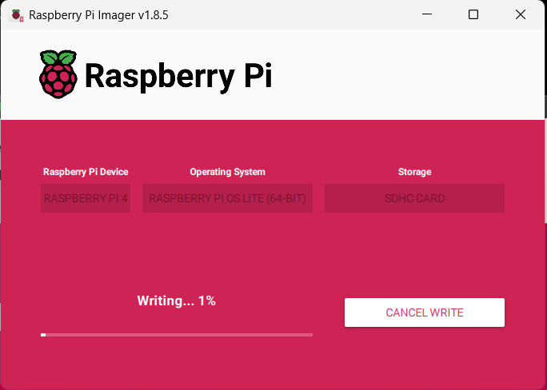
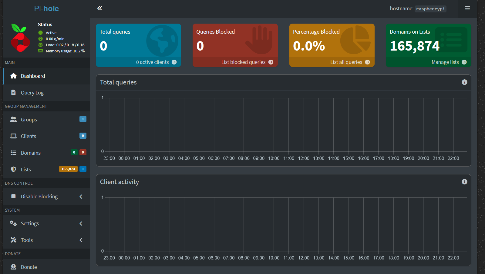
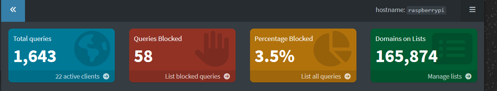
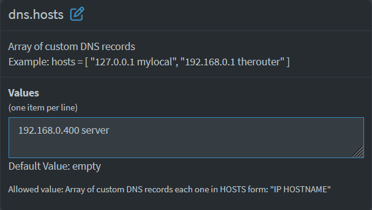

If you remember my [first homelab post](../2-first-home-lab-post) I mentioned at the end that I wanted to setup a reverse proxy for all the services that I'm currently self-hosting. 

Well, the first step in doing that I've recently learned is that you need to have a DNS server that directs all traffic to your domain, to the appropriate location. So first, I need to pick a domain to use. Since this is just local, I'm going to use `home`. 

The end goal is that if I visit `http://frigate.home` in my web browser, when on my home network, it should be smart enough to route the request to my server. That's the DNS server's job. What happens once the traffic is directed to the server? That's for another post, about my reverse proxy ([Traefik](https://traefik.io/traefik/) I'm coming for you.).

## Pihole

For those who don't know, pihole is a fairly popular adblocking solution, that works by maintaining a list of common sources of ads based on dns, and defends your home from them bravely.

<figure style="text-align: center;">
  
  <figcaption></figcaption>
</figure>

It's impressive because it can provide pretty well done whole-home adblocking, network monitoring, DNS server, and even a DHCP server if you want. And all of this functionality is very lightweight!

So lightweight that it runs on a Raspberry Pi without even blinking. Mine in question is the Raspberry Pi 4 (1GB) that I've had for about 5 years. I used to run a Discord bot off of it, then a Reddit scraper, but it's actually been powered off for a while...now that I have my mini PC chugging away with its massive 8GB of RAM I've left the Pi to rest and collect dust.

## Resurrecting the Pi

I have some stuff on this Pi, but I forgot my access credentials, and honestly I don't care enough so I'm just going to reflash its SD card and start fresh. Everyone deserves a fresh start.

I'm using [this guide](https://www.raspberrypi.com/documentation/computers/getting-started.html#raspberry-pi-imager) and it's all really quite straightforward. Download the OS, flash it onto the SD card, set it up so that it allows SSH, and maybe make the credentials whatever you want right away. I highly recommend not using pi/raspberry as your user/pass...everyone knows about it.

<figure style="text-align: center;">
  
  <figcaption></figcaption>
</figure>

I chose the Raspbian x65 Light, so it's headless, no desktop, no GUI, just ssh and a terminal. I used to hate headless installs, but now I'm a nerd and I prefer it, because monitors are a pain and the terminal is pretty good and there's all sorts of guides out there on how to use it.

## Setting up Pihole

### Install Pihole
So now that I've got a fresh new Pi it's time to install Pihole. I'm using this install [guide](https://docs.pi-hole.net/main/basic-install/). I debated using Docker, but I like this being on bare-metal and available via CLI. It also avoids all of the nasty networking that I'm still not great with when using Docker.

Once you've got the installer running, follow its prompts. Your Pi does need to have a static IP address, hopefully you've got a router that can do that but there are other ways to do it, so make sure you do that properly.

The setup is pretty full featured, and we're thankful for that. So now my Pihole is running at my raspberry pi `http://{ip-address-here}/admin` and it looks great.

<figure style="text-align: center;">
  
  <figcaption>So nice, clean, and pretty, but no traffic :/</figcaption>
</figure>

### Troubleshooting
I did have a small issue where it didn't have the list of domains that are ad domains, but you simply have to go to Tools>Update Gravity>Update and it pulls the most recent list of domains.

Notice that I have zero queries. This is suspicious, because all of our dumb connected devices are making calls out to the internet ALL the time. It's because traffic isn't being routed through pihole quite yet.

### Routing DNS
To do this, you need to either specify on every device that they should use the pihole IP address for DNS, or if you have it on your router, you can specify it there. That's how you do *whole* home ad-blocking. I'm going to do that for now, we'll see if I regret it, because if it blocks ads which services require, my household might not be thrilled when Netflix stops working or something like that.

...please hold...

### The aftermath
Okay so everything did break in my home network. I had to:

1. Update DNS on my router
    - Only primary is set to pihole address
    - No secondary
2. Reboot the router
3. Reboot any devices that were being annoying

After that things seem to be working, and look, I'm blocking ads!

<figure style="text-align: center;">
  
  <figcaption> Begone, ads!</figcaption>
</figure>

Disappointingly it appears that Mozilla Firefox has a bunch of telemetry requests immediately, which I guess makes sense as I'm using it while I write this, but I always hoped Firefox was a little better than that.

If anyone is new to Pihole and happens to be following this, at all times you have the ability to both:
1. Add any site you want to the blocklist
2. Turn off adblocking entirely for as long as you want

So if you notice things are breaking, move on over to your handy Pihole dashboard, turn it off, and see if that helps. If it does, you can identify the domain you want to let through, without turning everything off and go from there.

## Setting Up Pihole DNS

Okay great, we have Pihole setup, we're blocking ads as a nice added bonus, let's setup the Pihole DNS registry that routes all `.home` traffic to my Ubuntu server running all of my other services.

I referenced this [gist](https://gist.github.com/johndturn/a53d0a16c8aa5e564f5f2b7f53282254), it looks surprisingly easy. 99% of the work of this process was getting the right hardware to put it on, and getting everything installed and working. Basically the networking. I hate networking.

Anyways, for Pihole v6, which I actually had a hard time finding a decent amount of docs for, but I ended up with this:

<figure style="text-align: center;">
  
  <figcaption>I have the wonderfully creative 'server' domain chosen.</figcaption>
</figure>

But it doesn't work! 

I learned today (after ChatGPT lied to me) **that you need to have x.y, meaning instead I had to change `home` to `home.server`**. This is a bit frustrating, since if you look at the example, it makes it seem like you can just use a single word.

So now that I've updated to `home.server`, I can address my home server by using that directly in browser, in CLI, anywhere as long as I'm on my local network and that pretty much wraps it up!

## Conclusion

So we have successfully:
1. Imaged a Raspberry Pi from scratch
2. Installed Pihole
3. Established home-wide ad blocking with pihole by using it as DNS for my entire home network
4. Established a 1 line local DNS, that points the domain `home.server` to my Ubuntu server from my last homelab post.

Now that this is complete, I should be able to use Traefik how I hoped to, and follow guides like [this one](https://doc.traefik.io/traefik/user-guides/docker-compose/basic-example/). I'll  do my best to document my journey on that when I get there.