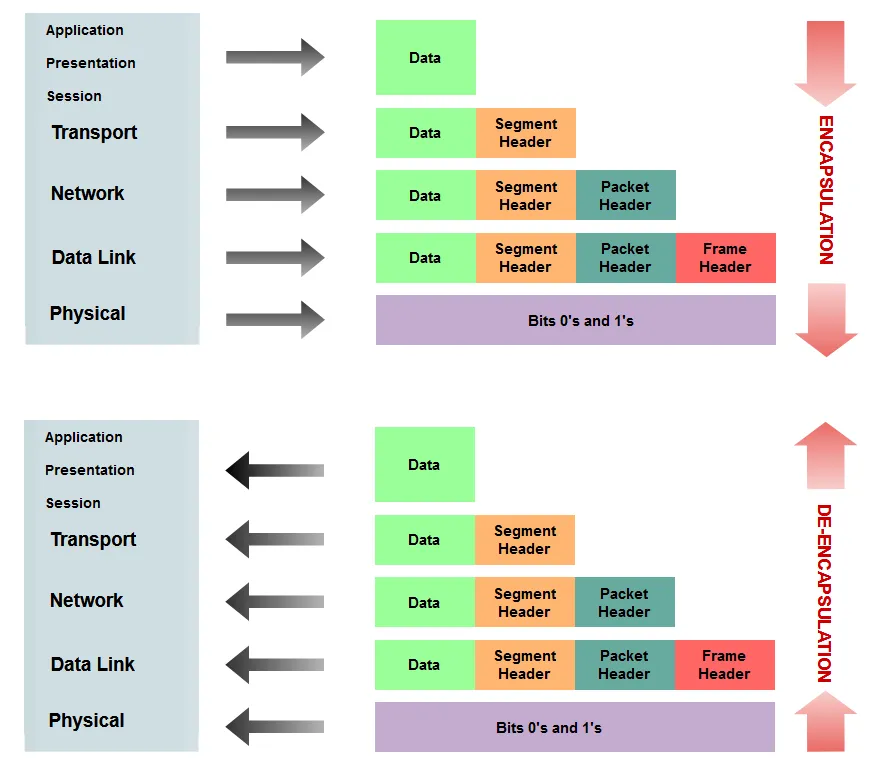
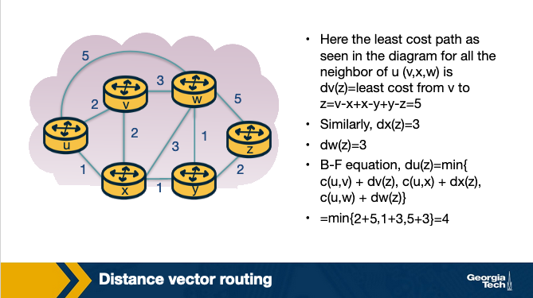

## Lesson 1 - Introduction, History, and Internet Architecture

### History of the internet

The internet began as many things in tech did, from DARPA.

Specifically:

1. J.C.R. Licklider proposed the "Galactic Network" (1962)
    - Attached a computer in Stanford to a computer at MIT, thus beginning computers talking to each other
2. The ARPANET (1969)
     - UCSB, UCLA, Stanford, and U of Utah interlink
3. Network Control Protocol (NCP), an initial ARPANET host-to-host protocol (1970)
    - The first protocol was designed to handle increasing number of computers, first app built on this was email
4. Internetworking and TCP/IP (1973)
    - NCP became TCP/IP, IP for addressing and forwarding packets, TCP for flow control and recovery from lost packets
5. The Domain Name System (DNS) (1983) and the World Wide Web (WWW) (1990)
    - As the internet exploded with content and endpoints, they needed a way to turn domains into IP addresses. In walks DNS.

### Internet Architecture

The internet was built in layers. Each layer is supposed to have its own job, and not rely on any of the layers above or below it.

Think of a person as a bit of data, then watch them fly from one airport to another and you get the idea.

So there is an originally designed theoretical layer named the OSI model, which had 7 layers, and then the layers that were actually implemented, known as the Internet Protocol Stack.

These layers are not as perfect as we would hope, specifically sometimes they do rely on the other layers or they both have methods of solving the same problem like error recovery.

Notice that the Session and Presentation layers disappear in the Internet Protocol Stack, those are handled in the *ports* of each network device. The logic that is accomplished in those layers still happens, just all in one place.

#### Application Layer

The data here is a **message**.

This is the layer we all interact with all the time.

- HTTP (web)
- SMTP (e-mail)
- FTP (transfers files between two end hosts)
- DNS (translates domain names to IP addresses)

Takes the content that we want to ship around, and does all the encoding and decoding needed to actually USE it.

#### The Presentation Layer

The presentation layer plays the intermediate role of formatting the information that it receives from the layer below and delivering it to the application layer. For example, some functionalities of this layer are formatting a video stream or translating integers from big endian to little endian format.

#### The Session Layer

The session layer is responsible for the mechanism that manages the different transport streams that belong to the same session between end-user application processes. For example, in the case of a teleconference application, it is responsible to tie together the audio stream and the video stream.

#### The Transport Layer

The data here is a **segment**.

End to End communication between hosts.

- Transmission Control Protocol (TCP)
- User Datagram Protocol (UDP)

TCP is better *connection*-oriented services, guarantees delivery, manages flow control, and controls congestion. This is the USPS, slow but reliable (except TCP doesn't lose mail like the USPS).

UDP is fast and guarantees *nothing*. Receivers and Senders using UDP must be able to handle segments getting dropped, delayed, or not making it entirely. But they should be faster when everything is working compared to TCP.

#### The Network Layer

The data here is a **datagram**.

This is where IP comes into play. This layer is responsible for connecting one computer to another, via the IP address that everyone has.

#### The Data Link Layer

The data here is a **frame**.

This layer is responsible for moving the frames from one node (host or router/switch) to the next node. This uses things like:

1. Ethernet
2. Point-to-point Protocol (PPP)
3. Wi-Fi

#### The Physical Layer

The actual hardware translation. Translating electricity into bits based on ethernet, coax, fiber, etc.

### Encapsulation

These layers work on the idea of encapsulation and de-encapsulation. So encapsulation is to take a chunk of data, package it up, add a header to it and pass it on. Then de-encapsulation is using the headers to decode each chunk of data, until all you're left with is the data/message.

This method is what allows people to build upon the existing infrastructure of the internet, but still make new things.

### The End to End (e2e) Principle

The e2e principle shaped the internet as we know it today.

Essentially the principle is that 99% of the complexity should be at the ends of the communications. This allows the underlying infrastructure to be simple, but expandable, and allows people working at the different ends to iterate and create new things quickly.

If they had to change the underlying architecture every time they wanted to change anything it would bring development speed to a crawl.

Beneficial excerpt from the lecture:

Many people argue that the e2e principle allowed the internet to grow rapidly because evolving innovation took place at the network edge, in the form of numerous applications and a plethora of services, rather than in the middle of the network, which could be hard to modify later.  

>What were the designers’ original goals that led to the e2e principle?  
>>Moving functions and services closer to the applications that use them increases the flexibility and the autonomy of the application designer to offer these services to the needs of the specific application.

>Thus, the higher-level protocol layers are more specific to an application. Whereas the lower-level protocol layers are free to organize the lower-level network resources to achieve application design goals more efficiently and independently of the specific application.

#### Violations of e2e

All rules are meant to be broken.

Firewalls, NAT boxes, and traffic filters all break the e2e principle, and usually for good reason.

NAT routers provide a way to make up for the fact that there aren't that many IP addresses available in IPv4. Instead of EVERY device having its own worldwide public IP address, you give your home 1 IP address, and then every device behind that has its own local address.

This means that whenever a message is sent to your PC it goes:

Web > Router (Public IP)> End Device (local IP)

The router is breaking some rules of e2e, because it is intervening and inspecting data.

This is the notes' reasoning for why:

> Why do NAT boxes violate the e2e principle?
>The hosts behind NAT boxes are not globally addressable or routable. As a result, it is not possible for other hosts on the public Internet to initiate connections to these devices. So, if we have a host behind a NAT and a host on the public Internet, they cannot communicate by default without the intervention of a NAT box.
>Some workarounds allow hosts to initiate connections to hosts that exist behind NATs. For example, Session Traversal Utilities for NAT, or STUN, is a tool that enables hosts to discover NATs and the public IP address and port number that the NAT has allocated for the applications for which the host wants to communicate. Also, UDP hole punching establishes bidirectional UDP connections between hosts behind NATs.

### The Hourglass Shape of the Internet

The internet is curvy.

No really, there's a ton on each end of it, but the middle is pretty narrow. Specifically, TCP, UDP, IP are really the backbone of literally everything. See below:

All roads lead to IP, and TCP/UDP. Researchers have actually done a lot of work to see why this is. They called it the evolutionary architecture model. They did a bunch of in depth quantifications of why/what the internet is and how they got there and drew some interesting conclusions.

In an ideal world where we could do it all over they came up with the following:

>Finally, in terms of future and entirely new Internet architectures, the EvoArch model predicts that even if these brand-new architectures do not have the shape of an hourglass initially, they will probably do so as they evolve, which will lead to new ossified protocols. The model suggests that one way to proactively avoid these ossification effects that we now experience with TCP/IP is for a network architect to design the functionality of each layer so that the waist is wider, consisting of several protocols that offer largely non-overlapping but general services, so that they do not compete with each other. 

### Interconnecting Hosts and Networks

Talking about how to theoretically communicate between computers is important, but hardware actually makes the physical connections.

Those are:

#### Repeaters and Hubs

They operate on the physical layer (L1) as they receive and forward digital signals to connect different Ethernet segments. They provide connectivity between hosts that are directly connected (in the same network). The advantage is that they are simple and inexpensive devices, and they can be arranged in a hierarchy. Unfortunately, hosts that are connected through these devices belong to the same collision domain, meaning that they compete for access to the same link.

#### Bridges and Layer-2 Switches

 These devices can enable communication between hosts that are not directly connected. They operate on the data link layer (L2) based on MAC addresses. They receive packets and forward them to the appropriate destination. A limitation is the finite bandwidth of the outputs. If the arrival rate of the traffic is higher than the capacity of the outputs, then packets are temporarily stored in buffers. But if the buffer space gets full, then this can lead to packet drops.

 #### Routers and Layer-3 Switches
 
These are devices that operate on the network layer (L3).

### Learning Bridges

A bridge is a piece of hardware that manages the connection between many devices, connected to the same piece of hardware.

The bridge is able to understand what devices are on port 1, what devices are on port 2, and so on. This is like a home network switch. You can connect many devices to it, and it handles knowing where the data needs to end up.

#### The Looping Problem

The problem with these bridges, is that you can create a loop.

if A connects to B which connects to C which connects to A, you've created a loop. This can result in never ending looping!

This is handled by running a spanning tree algorithm. The goal of the spanning tree algorithm is to identify which ports when used will eliminate any endless looping.

This works by operating in rounds, and then by removing bridges from the network until you only have one path to every node. This is accomplished by running in rounds the following process:

1. Every node sends:
    - Sender Node ID
    - Root ID as perceived by sender
    - Distance from root node
2. Each node selects the best configuration in order of
    - If root of the one configuration has a smaller ID
    - If roots have equal IDs choose one with smaller distance to the root
    - If they have the same distance, choose configuration with smallest sender ID
3. A node stops sending configuration messages over a link (port) when it receives a configuration message from a neighbor that is:
    - either closer to the root
    - has the same distance from the root, but it has a smaller ID.

We can see this process completed in the following images:

Then after tree spanning:

## Lesson 2 - The Transport Layer (TCP)

This lesson is going to talk about the actual protocol responsible for transporting data from one location to another, TCP. The logical connection between two hosts is done in the transport layer.

The transport layer receives a message from the application layer and appends its own header on to it. This is known as a segment. The segment is then sent to the Network layer where it happily bounces through all the routers, bridges, and switches that might be on its path.

### Transport Layer intro
Why do we need a transport layer? Why not just send messages directly from the application layer to the network layer? Because the network layer guarantees __nothing__. The transport layer guarantees delivery, and data integrity in a way that wouldn't have been done otherwise.

As mentioned previously there are two main transport layer protocols User Datagram Protocol (UDP) and Transmission Control Protocol (TCP).

UDP just tries to quickly send data, and doesn't do much else. As such it provides no guarantees and puts the responsibility on the application layer to do things like verify integrity and handle dropped messages.

TCP on the other hand does have these extra bells and whistles built in and thus it is much more reliable, if not a tad slower than UDP.

### Multiplexing

Multiplexing is the ability for many hosts to use the same network simultaneously. Consider two computers browsing the internet at the same time, or better yet, a computer that is simultaneously browsing the internet and streaming music, it has two incoming data sources, and used in two different ways.

We need to be able to handle this complexity. The Transport layer uses ports to do this. Each application gets one port, and listens only to that port.

There is **Connectionless** and **Connection Oriented** multiplexing. One based on a constant connection, and one is not. 

We have names for each direction of this multiplexing operation.

Demultiplexing - Delivering data to the appropriate socket.

Multiplexing - Taking data from all the sockets and putting it into the network layer.

### Connectionless Multiplexing

Connectionless multiplexing is the simpler case. The transport layer has a segment which has the content, a source and source port, and a destination and a destination port. It receives the data from the source port, and makes its best effort at delivering to the destination port.

If the destination receives it, great, the network layer will route it to the correct port, and then the message will have been successfully delivered.

These are UDP sockets. It's very direct, with no oversight as to what actually happens to the message.

### Connection Oriented Multiplexing

Connection Oriented multiplexing brings in a lot more complexity.

TCP requires going through a TCP server. The TCP server has a listener process that waits for incoming connection requests, and when it gets it handles setting everything up so that the destination is ready to receive the message.

> Note: If a server has many clients contacting it on the same port, it's not an issue because they have unique IP addresses (hopefully) and they can distinguish the difference between the two that way.

### A word on UDP

UDP lacks reliability of TCP mainly because it doesn't require establishing a connection.

That lack of reliability makes it better for the following reasons:
1. No congestion control - No process watches every packet to make sure it should be sent
2. No connection management - We don't have to wait for a socket to be opened, so it just sends quickly

Both of these result in lower latency transmission, which is good for some things. Things like multiplayer video games, DNS servers, and other networking hosts, all like to use higher speed protocols.

This puts the onus on the developers on each end to ensure quality, and handle if errors occur, but when things are working well, then things are very speedy.

The one quality mechanism UDP provides is a checksum, so you can in fact check that the data that's sent is what it was supposed to be. It creates a checksum by adding together the bits of the source port, destination port and the length of the packet. It then performs a ones complement. That is the checksum.

The receiver takes the source port, destination port, length of packet, and the checksum and adds them all together. Because the checksum is the ones complement, when they are added together it should end up as all ones.

### TCP

#### Three way handshake

    Step 1: The TCP client sends a special segment (containing no data) with the SYN bit set to 1. The client also generates an initial sequence number (client_isn) and includes it in this special TCP SYN segment.

Step 2: The server, upon receiving this packet, allocates the required resources for the connection and sends back the special "connection-granted" segment which we call SYNACK segment. This packet has the SYN bit set to 1, the acknowledgement field of the TCP segment header set to client_isn+1, and a randomly chosen initial sequence number (server_isn) for the server.  

Step 3: When the client receives the SYNACK segment, it also allocates buffer and resources for the connection and sends an acknowledgment with SYN bit set to 0.

#### Connection tear down
Connection Teardown

Step 1: When the client wants to end the connection, it sends a segment with FIN bit set to 1 to the server.

Step 2: The server acknowledges that it has received the connection closing request and is now working on closing the connection.

Step 3: The server then sends a segment with FIN bit set to 1, indicating that connection is closed.

Step 4: The client sends an ACK for it to the server. It also waits for some time to resend this acknowledgment in case the first ACK segment is lost.

### Reliable Transmission (TCP)

TCP guarantees all packets delivered in order. This is a very helpful reliability for developers to build on.

To do this the sender must know what the receiver successfully got. This is accomplished via ARQ (Automatic Repeat Request). If a sender doesn't get a message that ARQ1 was received in a certain timeframe, then it will re-send it.

**Stop and Wait ARQ** 

Guess how long it should take, if you don't get a response, send it again. This can work but is tricky. If you send too much you're retransmitting for no reason, and wait too long your connection is slow.

TCP uses **Selective ACK** which basically waits for the receiver to say hey I didn't get this packet yet, and if it reaches a certain threshold like 3, then it will quickly resend that particular packet. This allows most of the time to be spent actively sending data, and the ability to recover from dropped packets.

This does require the ability to buffer packets until you have everything you need in order.

### Transmission Control (TCP)

Deciding how much of a link bandwidth to use is a bit complicated. If you send too much for the receiver that could be an issue, or maybe the network can't handle it, or any other amount of things that could go wrong. 

So TCP implements a couple things to help that.

#### Flow Control

Flow control is where TCP tries to identify the receiver's buffer that it is receiving data with, and tries to match the sender window size to that. Every ACK message includes a `rwnd` value which says how much buffer space is available.

The sender uses this value to ensure it never sends more bytes than is available in the receiver buffer. 

If this value hits zero it would stop, but TCP instead sends packets of 1 byte until it gets a response with a `rwnd` greater than zero.

#### Congestion Control

Congestion control is making sure we don't overload any of the links on the way from one host to another.

Good congestion control is:
- Efficient - use most of the network
- Fair - everyone gets equal amounts
- Low delay - Low delay is good for things that need to have small lag like video conferences
- Fast convergence - everyone gets their bandwidth quickly

##### Network Assisted

Network assisted congestion control relies on pieces of the network sending feedback about what's happening. This could fail when the network is heavily congested though, kind of rendering it useless.

##### End to End

End to end congestion control gets nothing from the network and instead infers congestion from the hosts. This supports the general principle of making the complexity be at the ends of the networks.

This is mostly done via packet delay (how long did it take to get here) and packet loss (how many times do I need to resend). With these two things you have a rough understanding of network performance at any given moment.

It employs a congestion window, a number indicating roughly how much space is left in the network. This increases until congestion is detected, and then the window is made smaller to reduce congestion.

Ultimately the max size of a TCP packet is the minimum of the receiver buffer and the congestion window.

There are many different methods of increasing congestion window size:

- Additive
- Multiplicative
- TCP Reno
- AIMD

Many of these employ "Slow start" where they start at a low-ish speed and ramp up. This protects from overwhelming the network right at the start. With timeouts or dropped connections being common you can see why this would be useful.

TCP isn't always fair, but using some of these congestion methods will do a pretty good job of it.

#### TCP Throughput

TCP Throughput looks like a sawtooth because of these congestion control mechanisms.

It gets up to the limit, then drops off, then gets up to the limit then drops off.

## Lesson 3 - Intradomain Routing (The Network Layer)

This session focuses on the act of routing on the network layer in a single domain. Ideally we understand what it takes for two hosts to share data by the end of this.

We'll talk about:

- Intradomain Routing Algorithms
    - Link state
    - Distance vector
- Intradomain Protocols
    - Open Shortest Path First (OSPF)
    - Routing Information Protocol (RIP)

### Routing

Given two hosts that share the same default router (first-hop router) we know that one host will send a packet to the default router, but what happens next?

In a network with many routers, whenever a router receives a packet, it must consult the forwarding table it maintains, and send the packet to the next router in line. This is referred to as forwarding and is not necessarily the same as routing.

Routing is the act of determining the best path to be traveled from one location to another. Intradomain routing is what we will focus on and it is what happens when both hosts are in the same administrative domain.

Interior Gateway Protocols (IGP) are what handle this type of routing. The two major types we'll cover are  link-state and distance-vector routing algorithms. They are graph theory algorithms with edges and nodes.

#### Link State Routing

Surprise, Dijkstra's algorithm is here again.

In link state, all link costs are known and the network topology is also fully known.

From the lecture directly.

> Let’s introduce some basic terminology. By u, we represent our source node. By v, we represent every other node in the network. By D(v), we represent the cost of the current least cost path from u to v.  By p(v), we represent the previous node along the current least cost path from u to v. By c(u,v), we represent the cost from u to directly attached neighbor v. By N', we represent the subset of nodes along the current least-cost path from u to v.

Basically we initialize with either:

- Known cost because it's a link directly connected to the node we're initializing
- Infinity cost, because we know it will be less than that but we have something to compare against

Then we continue looping through the network, looking for a path with lower costs than our current cost, until we don't find one. This is a fun application of Dijkstra's algorithm, where each router essentially computes Dijkstra's algorithm from itself to all other routers in the network.

This is a pretty costly algorithm at O(n^2) complexity. It also requires that you know everything about the network which is probably why this is intradomain and not interdomain.

#### Distance Vector Routing

The DV algorithm is iterative, asynchronous, and distributed.

DV is based on the Bellman Ford algorithm. Every node maintains a distance vector to all of the other nodes, and it occasionally shares that information. When a node receives a new distance vector they use it to update their own vector.

The Bellman Ford (BF) equation is the heart of each update: `Dx(y) = minv{c(x,v) + Dv(y)}`

See the pseudocode below:

So essentially, continuously the nodes maintain a list of costs for routes to certain nodes, and these costs are updated whenever nodes send their costs. So instead of every node needing to know every cost, it allows the nodes to only know and focus on the costs of its immediate neighbors, and then relies on other nodes sending its current list of costs occasionally.

This is different from Link State routing because it is distributed, but they are all still computing the most efficient path through the tree.

##### A simple example

[initialization](<Screen Shot 2020-01-17 at 5.40.22 PM.png>)

##### Pitfalls of DV

What if the link cost changes? In some cases this is handled quickly, and in other cases it can lead to a "count-to-infinity" problem.

**Say a link cost decreases:**

1. At time t0, y detects that cost to x has changed from 4 to 1, so it updates its distance vector and sends it to its neighbors.
2. At time t1, z receives the update from y. Now z thinks it can reach x through y with a cost of 2, so it sends its new distance vector to its neighbors.
3. At time t2, y receives the update from z. Y does not change its distance vector, so it does not send any update.

The update is fully propagated pretty quickly.

**Say a link cost increases:**

1. At t0, y detects that the cost has changed, and now it will update its distance vector thinking that it can still reach x through z with a total cost of 5+1=6.
2. At t1, we have a routing loop where z thinks it can reach x through y, and y thinks it can reach x through z. This will cause the packets to be bouncing back and forth between y and z until their tables change.
3. Nodes z and y keep updating each other about their new cost to reach x. For example, y computes its new cost to be 6 and then informs z. Then z computes its new cost to be 7, and then informs y, and so on.

The key here is that Node Z, is saying Hey I can definitely reach X, and the cost as Z knows it, is 5. So Node Y says sweet, if I go through Node Z, it's the cost of our link (1) + the cost of Z > X, but the cost of Z > X isn't actually 5 anymore, it's 50.

So they have to iterate until the cost is greater than 50, at which point it will use the real path.

The reason that we can't directly say, "hey no the link cost increased by a ton your table is wrong" is because we don't know the structure of the network. All we know is X > Y costs a certain value, with no understanding of which links do that.

So instead we have to keep iterating through until the costs are actually updated. This can create a lot of packet bouncing.

This is solved by something called *poison reverse* where a node says a cost is infinity if it isn't the cheapest path to a certain node. This only works for 2 nodes.

#### Routing Information Protocol (RIP)

RIP is based on Distance Vectors, but instead of maintaining vectors of distances, they instead maintain entire routing tables with one row for each subnet.

#### Open Shortest Path First

OSPF is a routing protocol that uses link-state to find the best path between source and destination routers. It was created after RIP by ISPs with extra things like authentication messages, multiple same-cost paths, and support for hierarchical routing within a single domain.

OSPF will have one AS (Autonomous System) as the backbone, and routes to other OSPF AS on the network. To go from one Area to another, they must move through the backbone router.

There's a lot more in the notes but tbh they're pretty complicated! It seems that these routers in the send Link State advertisements which communicates the routers local topology. This results in a complete network map, that updates when the network updates.

These LSAs are processed as so:

### Hot Potato Routing

Sometimes you have to leave your local network, and enter into interdomain routing.

To do this usually you have to find an egress point and the process of finding that egress point is an intradomain routing problem.

Generally hot potato routing is referring to finding the closest/least costly egress point in a given network. The hot potato part of it is that there are many egress points and which one is chosen is not always clear. This routing method of finding the shortest path does make things consistent instead of sometimes going to egress A and sometimes going to egress B.

## Lesson 4 - Interdomain Routing and AS Relationships

[Lesson 3](#lesson-3---intradomain-routing-the-network-layer) focused on intradomain routing, but what about when we need to leave our domain?

The internet is an ecosystem of thousands if not millions of networks operated independently, but still connected to each other. This lesson we'll learn about BGP.

### The Internet

The internet started very hierarchical but has been flattening as more IXPs and CDNs have been added.

Each of the types of infrastructure above can be an Autonomous System (AS) which is a group of routers who are under the same authority. I think like, my house technically is an AS that I manage, but not sure about that.

Routing between AS's relies on Border Gateway Protocol (BGP) to exchange information with each other. 

### AS Ecosystem

There's two main interactions between AS's.

- Provider-Customer - Like me paying my ISP for internet
- Peer - One ISP routing to another ISP because they need their network to get to location x. This requires traffic levels to be pretty similar so that one party isn't gaining more than the other.

See how green cloud ISP can't peer with orange cloud ISPs, because it's too large. But all the orange cloud ISPs are peer relationships because they're similarly sized.

Providers can charge fixed rate or based on usage, totally up to them.

### Internet Business

Importing and Exporting routes is the heart of BGP. Deciding which import/exports to operate and make available is a technical and business decision.

#### Exporting Routes

Export routes come from:

- Routes from customers
- Routes from providers
- Routes from peers

Which of these are chosen to advertise to other AS's is a business decision.

#### Importing Routes

Again, they're picky based on which routes are going to bring the most value to the business.

Usually it's this order:

1. An AS wants to ensure that routes toward its customers do not traverse other ASes, unnecessarily generating costs.
2. An AS uses routes learned from peers since these are usually "free" (under the peering agreement).
3. An AS resorts to importing routes learned from providers only when necessary for connectivity since these will add to costs.

### Border Gateway Protocol (BGP)

#### BGP Design Goals

- Scalability - The internet will never stop growing, try to handle it
- Express routing policies (ERP) - Allows ASes to make routing decisions and do it privately
- Allow cooperation among ASes - Allows ASes to make their own decision and let business drive the connections
- Security - This was added on as it was found to be necessary

#### BGP Basics

**BGP Peers** send messages over **BGP Sessions** over a semi-permanent TCP port connection. A session is initiated from one router to another with an OPEN message which is then followed by sharing routing tables.

eBGP is an external BGP session, between two ASes. iBGP is an internal BGP session, in a singular AS.

Once the session is started they use:

- UPDATE - if any updates are made to the Route table, share it
- KEEPALIVE - Keeps session going, no changes

BGP relies on prefix reachability, a list of IP addresses that prefix all the destinations. This is how the export and import routes are communicated.

Other parameters:

**Path Attributes** are also shared with other providers with parameters like:

- ASPATH - Contains Autonomous System Number and helps choose between multiple routes and stops loops
- NEXT HOP - Provides the next router's IP address so that other routers can store in their forwarding table the best path

#### iBGP vs eBGP

iBGP is meant for sharing paths of how to get out of an AS, it's not an IGP that gives intradomain networking, but instead a way of telling nodes inside of AS how they can communicate with external ASes.

eBGP is the method of communicating between ASes the available external routes.

#### BGP Router Process

When a router receives a new list of policies it takes them all in, and then has a decision making process to determine the best routes for it to use.

The operator of this router can determine what is important to them (usually cost related) and make decisions based on that. Here's an example decision process.

Important decision makers are:

LocalPref - Decided by operating AS, things like choose the cheaper route (customers first, then peers, etc)
MED - Determined by the neighboring AS, determine which link they would prefer you to use

#### BGP Issues

Two main things:

- Misconfiguration - Improper configuration can bring networks down for a lot of reasons
  - Can be reduced by limiting size of tables and number of changes
- Scalability - Large routing tables are problematic.

A lot of work went into reducing routing table sizes. They will do things like use default routing, route aggregation, and something called **flap damping**. Flap damping is a technique that limits the number of updates to a given prefix over time. If it goes over a certain limit, it will silence that prefix's updates until a set time has passed.

This is configurable by domain, allowing you to choose when and where you will accept a lot of updates and when you won't.

### Peering at IXPs

ASes peer with each other, where do they do that? One place is an Internet Exchange Point (IXP). They are purpose built infrastructure to facilitate peering.

Internet Exchange Points (IXPs) are critical physical infrastructures where Autonomous Systems (ASes) can directly interconnect and exchange traffic. These facilities are typically housed in secure, well-powered data centers and consist of robust switch fabrics to ensure reliability and fault tolerance. ASes participating in IXPs must have a public ASN, a BGP-capable router, and agree to the IXP’s terms. Once connected, ASes can publicly peer and exchange traffic settlement-free, paying only for connection and port usage, not traffic volume. This makes IXPs more cost-effective and efficient than traditional third-party traffic routing.

IXPs have grown in popularity due to their ability to handle massive volumes of traffic and play a crucial role in improving network performance and reducing costs by keeping local traffic local. They also offer defensive benefits, such as DDoS mitigation, since they observe a large portion of Internet traffic and can help stop malicious activity before it reaches the intended target. Furthermore, IXPs provide a rich environment for research and innovation, particularly in areas like security and Software Defined Networking (SDN), and are evolving into hubs of technology development beyond just traffic exchange.

In addition to public and private peering services, IXPs offer a wide range of features such as route servers, SLAs, remote peering via resellers, mobile network peering, and DDoS blackholing. Some IXPs also provide free value-added services like DNS root servers and time distribution. These offerings, along with the ability to form fast and scalable peering agreements, have made IXPs essential infrastructure for global Internet connectivity, performance, and resilience.

#### Route Servers

IXPs use route servers to handle the large number of ASes that they service.

In summary, a Route Server (RS) does the following:

- It collects and shares routing information from its peers or participants of the IXP that connect to the RS.
- It executes its own BGP decision process and re-advertises the resulting information (e.g., best route selection) to all RS's peer routers.

It's basically offloading all the configuration work from the AS to the IXP operator. It's what allows people like me to buy a domain and get reliable routing from anywhere in the world to it.

## Lesson 5 and 6 - Router Design and Algorithms

Routers are what do the heavy lifting for actually moving data from one point to another. The prior lessons established many pieces and parts of that puzzle.

In short, a router needs to be able to receive an incoming packet on an input link, read its destination, and then send it to the correct output link. Simple in theory, difficult in practice, and more importantly, at scale. Then add on top of just forwarding requirements things like security requirements, quality of service, and other more advanced things, the job becomes difficult.

### Router Components

**The main job of a router is to implement the forwarding plane functions and the control plane functions.**

#### Forwarding (Switching) function

The action of transferring a packet from an incoming link, to an outbound link. This should be very fast, on the scale of a few nanoseconds. I believe this is what a nice simple 5 port network switch is, and that's all it is.

**Input Ports**

Input ports do the following:

1. Physically terminate the link
2. Processes datalink (decapsulating)
3. Performs lookup function, consulting forwarding table to determine where it should go

**Switching Fabric***

This actually moves the packet from the input port, to the output port, using the results from the input port that tells where the packet needs to go.

Three types of switching fabrics:
- Memory
- Bus
- Crossbar

**Output ports**

All this does is receive the data from the switching fabric and send it. Specifically:

1. Queue the packets for transfer
2. Encapsulate the packets
3. Send them over the physical output port

#### Control Plane function

The control plane refers to:

- Implementing routing protocols (like the ones from earlier sessions)
- Maintaining routing tables
- Computing the forwarding table

All of these functions are written software in the routing processor, or in the case of an SDN, could be implemented by a remote router.

### Router Architecture

Model of a router:

Using the image as a guide we can walk through the path that common tasks take. First we lookup the destination of an incoming packet.

1. Lookup
    1. Packet arrives at input link
    2. Lookup output link in forwarding table (Forwarding Information Base FIB)
    3. Resolve any ambiguities
        - Longest Prefix matching
        - Packet classification
2. Switching
    - After lookup is completed the packet is switched, from input link to output link. Modern routers use crossbar switches for this task.
    - *Some complications occur when many inputs want to send to the same output*
3. Queuing
    - Using various queuing logics, if an output port is congested, each packet enters the queue to wait its turn to use the hardware.

    - Types of queues used:
        - First In First Out (FIFO)
        - Weighted Fair Queuing
4. Header Validation and Checksum
    - Check version number, validate checksum, decrement ttl
5. Route processing
    - Build route using protocols like RIP, OSPF, and BGP
6. Protocol Processing (Including:)
    - Simple Network Management Protocol (SNMP) - Counters for remote inspection
    - TCP/UDP for remote communication
    - Internet Control Message Protocol (ICMP) for sending error messages (eg: TTL is exceeded)

### Switching Fabric

The switching fabric is where most of the logic is implemented in a router, forwarding packets from source to destination.

There are several ways to accomplish this.

#### Switching via memory

Physical I/O ports operate as I/O devices in an operating system.

1. Input port receives packet
2. Send interrupt to routing processor
3. Packet written to memory
4. Processor looks at header to get destination address
5. Lookup output port from forwarding table
6. Copy from memory into output ports buffer

#### Switching via bus

Bus based switching doesn't require a processor.

1. Input port receives packet
2. Input port marks which destination port it should be for with an internal header
3. Send it to the bus where all output ports receive the packet
    - Only the port it's supposed to go to accepts it

This design is limited by the speed of the bus as only one packet can traverse it at a time.

#### Switching via interconnection network

A crossbar switch is an interconnection network that connects N inputs to N outputs using 2N buses.

This allows many packets at once to traverse the switching fabric, as long as they have different input and output ports. This is done by giving the switching fabric control of the buses, and closing the connections to make the links only when there is a packet that needs to make that journey.

### Router Challenges

There are a couple fundamental challenges to overcome for routers at scale.

1. Bandwidth and Internet population scaling
    - Rapidly increasing number of devices (endpoints)
    - Rapidly increasing volume of data
    - New types of links like optical links (fiber) which increase transfer but increase complexity
2. Services at high speeds

#### Common bottlenecks

A little bit more detail:

**Longest prefix matching** - Due to the ever increasing number of devices on the internet, it's impossible to hold a table for *all* of them. So instead devices are grouped into prefixes. But then you need good algorithms to deal with the prefixes.

**Service differentiation** - If you want to be able to provide priority to some packets and not to others, you need more complex logic to handle that. At scale.

**Switching Limitations** - At high speeds, the hardware can become a problem, causing bottlenecks at the I/O ports or even on the switching hardware.

**Bottlenecks about services** - Providing a reliable, fast, secure service that is **guaranteed** is difficult. Entire companies are built around doing this so that others don't have to.

### Prefix matching

Prefixing is a way to group endpoints together to make lookup tables less large.

**Prefix Notation:**

There are several ways to notate prefixes.

1. Dot decimal
    - 16 bit (132.234) becomes binary of 1000010011101010
2. Slash notation
    - A/L, A=Address, L=Length
    - 132.238.0.0/16
3. Masking
    - 123.234.0.0/16 is written as 123.234.0.0 with a mask 255.255.0.0
    - The mask 255.255.0.0 denotes that only the first 16 bits are important. 

This prefixing helped, because we were running out of IP addresses, quickly. But it introduced the issue of *longest matching prefix lookup*.

The main router performance metric is how quickly it can do a full lookup. There are four common problem areas:

1. A large amount of traffic is concurrent flows of short duration, making caching not very useful.
2. Lookup speed is important, the most costly part of that is accessing memory
3. An unstable routing protocol may result in more updates to the table and slower updates, adding milliseconds of time to the table update time.
4. Cost vs performance, really expensive memory is fast, cheaper memory is slower
    - how to decide which is which likely depends on application

#### Unibit Tries

Given this prefix db:

Results in this trie:

These are the steps we follow to perform a prefix match:

1. We begin the search for a longest prefix match by tracing the trie path.
2. We continue the search until we fail (no match or an empty pointer)
3. When our search fails, the last known successful prefix traced in the path is our match and our returned value.

Two notes:

1. If a prefix is a substring of another prefix, the smaller string is stored in the path to the longer (more specific prefix). For example, P4 = 1* is a substring of P2 = 111*, and thus P4 is stored inside a node towards the path to P2.

2. One-way branches. There may be nodes that only contain one pointer. For example, let’s consider the prefix P3 = 11001. After we match 110 we will be expecting to match 01. But in our prefix database, we don’t have any prefixes that share more than the first 3 bits with P3. So if we had such nodes represented in our trie, we would have nodes with only one pointer. The nodes with only one pointer each are called one-way branches. For efficiency, we compress these one-way branches to a single text string with 2 bits (shown as node P9).

#### Multibit Tries

Unibit tries are very efficient but it requires a large amount of memory accesses to achieve. For highspeed links it is not plausible to access memory that many times. Instead we use strides. A stride is the number of bits to check at each step.

So an alternative to unibit tries are the multibit tries. A multibit trie is a trie where each node has 2k  children, where k is the stride. Next, we will see that we can have two flavors of multibit tries: fixed-length stride tries and variable-length stride tries. 

##### Prefix expansion

One quick problem you may run into with multibit, is if you have a stride length of 2, you could miss prefixes like 101* so this is handled via expansion:

#### Fixed Stride Example

Using a fixed stride length of three, let's do an example. Using the same database as the prior example.

Some key points to note here:

1. Every element in a trie represents two pieces of information: a pointer and a prefix value.
2. The prefix search moves ahead with the preset length in n-bits (3 in this case) 
3. When the path is traced by a pointer, we remember the last matched prefix (if any).
4. Our search ends when an empty pointer is met. At that time, we return the last matched prefix as our final prefix match.

#### Variable Stride Length

Variable Stride length allows us to save memory and still get all of the addresses.

Some key points about variable stride:

1. Every node can have a different number of bits to be explored.
2. The optimizations to the stride length for each node are all done to save trie memory and the least memory accesses.
3. An optimum variable stride is selected by using dynamic programming

