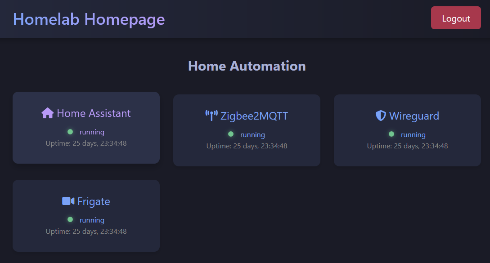

This is my first post on this topic, and first post on this site. I hope to use this site primarily as a notebook for myself on what I've tried, and any useful notes or thoughts that come out of it. If this is ever useful for others, well that's a cherry on top.

## My Home Lab
A home lab is a lot of things for a lot of people. For me it's a way to host higher quality media than Netflix can stream, host home automation, and host some home security. It also serves as a pretty fun development playground where I can work with all sorts of interesting open source projects and fiddle to my hearts content. 

I've done things like make my own websites and hosted them off of it for trial runs, hosting open source projects and using them to see if I like them, and just general satisfactions of curiousities that I have. 

I once vibe-coded (before they called it vibe coding thank you very much) a "homelab-homepage" that I thought was neat. If you don't know me, I'm a python developer, with zero JS and zero frontend experience, so I got deep into the weeds with CSS + HTML + Jinja2 + Copilot to create a semi-functional dashboard page. The goal was it would would be a landing page I could access all my services from without having to create a million bookmarks or remember what port my Wireguard server was running on when I need to access it 5 months after I set it up.

"homelab-homepage" has:
- Simple Auth (Simple login that's setup on first startup)
- Docker Health Monitoring (periodically check status of docker containers)
- Fully Responsive (Thanks chatgpt and an absurd amount of css)
- Hot links to all my home server landing pages (ports be gone)
- A `Dockerfile` and accompanying `compose.yaml` that I thought maybe one day people would use
Here's a short screenshot:

I then of course found a much better already completed product at [homepage](https://gethomepage.dev/) and promptly abandoned that project, but I learned a lot so I still see it as a win.

Anyways...on to what I was originally going to write about.

# My Homelab setup

Here is the current list of things that makeup my homelab. It's not much, but it's more than enough to satisfy my current usecase.

## Compute
HP Prodesk 600 G3
- Intel Core i5-7500T 2.7  GHz
- 8 GB RAM
- 1 TB OS SSD
- 2 TB External Media Drive

## Services
- [Home Assistant](https://www.home-assistant.io/) - Home Automation
- [Frigate](https://frigate.video/) - Home Surveillance
- [Plex](https://www.plex.tv/) - Home Media Server
- [audiobookshelf](https://www.audiobookshelf.org/) - Hosted Ebooks and Audiobooks
- [Mosquitto](https://mosquitto.org/) - MQTT Server
- [WG-Easy](https://github.com/wg-easy/wg-easy) - Wireguard Tunnel 